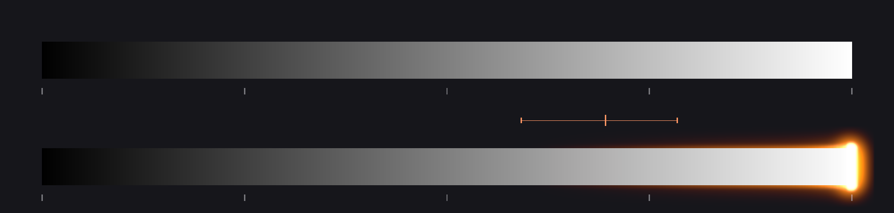
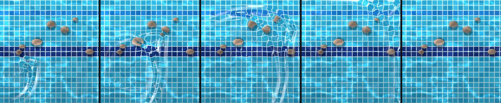
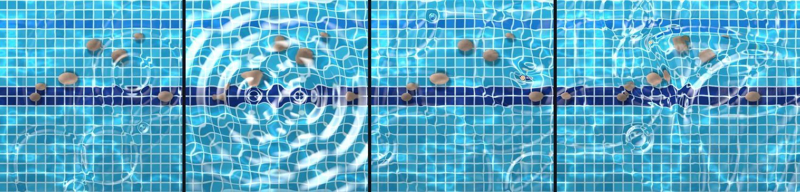
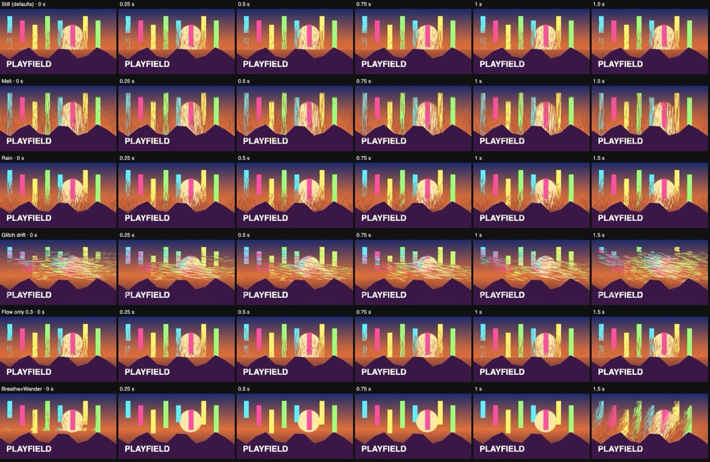
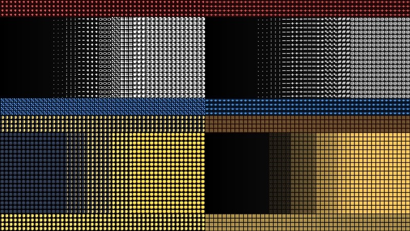

# The Finish stack

Play's **Finish** tab: colour grading, lens and screen effects, film effects,
camera shake, time displacement, warps, glitches, a simulated water surface,
stylised looks (pixel sort, halftone, ASCII, light leaks) and temporal effects
(feedback, echo, datamosh, motion extract) over the **final**
picture, the shader and every layer together. One ordered stack per Play record
(`play.finish`). Any effect can show only **somewhere** (its Where: a layer's
shape, the bright parts, where the camera sees movement, or where the water moves).

- Engine: `src/play/kit/finish.js` (+ `finishGlsl.js`, shared with the Studio's
  Tone Map and CRT Mask nodes). Part of the layer kit, so the app and exported
  pages run the same code.
- Record, parsing, control targets, Looks, custom effects' records:
  `src/types/playFinish.ts`.
- Stack presets and Your effects (the device's lists): `src/play/finishLibrary.ts`.
- Effects from nodes (node effects and the Look effect editor's graphs, compiled
  to effect code): `src/play/lookGraph.ts`, their stored form
  `src/play/lookGraphRecord.ts`.
- UI: `src/components/play/finish/` (`FinishPanel`, `CurveEditor`,
  `ColourWheel`, `CompareHandle`, `savedLooks`, and the Look effect editor:
  `EffectEditor`, `EffectGraphEditor`, `MiniGraph`, `effectGraphLayout`).
- Tests: `src/play/__tests__/finish.test.ts`, `finishFollowups.test.ts`
  (the wipe, custom effects, presets, the library) and `finishMaps.test.ts`
  (Where, the maps, the new effects, particles born where a map says) and
  `finishCreative.test.ts` (pixel sort, halftone, ASCII, light leaks, presets and
  swatches, the passes a stage effect splits a stack into) and
  `finishTemporal.test.ts` (feedback, echo, datamosh and motion extract: their
  records, passes, grids, rings and maths) and `finishLookMotion.test.ts`
  (pixel sort's motion, ASCII's typed characters, the rules' Look actions) and
  `finishWater.test.ts` (Water: the solver, its clock, rain, Splash, the example);
  `lookGraph.test.ts` (effects from nodes: which nodes qualify, the code they
  compile to and how it lands in the pass, hints in uniform comments, the graph
  through the record, Your effects and a website export);
  node packs carrying
  effects in `src/nodePacks/__tests__/nodePacks.test.ts`.

## Where it runs

| Place | How |
| --- | --- |
| Play preview, Stage (Full) | `play/overlay.ts` draws the layers as usual, then `fnCreate`'s renderer composites the WebGL picture and the layers' canvas into its own WebGL2 canvas, stacked above both. Null markers, hands and handles go on a separate guides canvas above that, so they are never graded or bent. |
| Recordings (MediaRecorder) and PNG snapshots | `startCompositing` / `snapshot` copy the finished canvas instead of picture + layers. |
| Takes, offline renders (FFmpeg, PNG sequence), transparent stills | `compositePixels` → `finishPixels`: the frame's RGBA goes through a second renderer (so the live preview's time ring is untouched) in pixels mode and is read back in place. Frame-exact: grain, flicker and shake are functions of the frame's time, and the time ring and every temporal effect's frames start over on the first frame. |
| Exported websites, Stage (Exact), Present | `play-runtime.js` creates the same renderer over its canvases when `SSKit.finish.active(play.finish)`. Mapped numbers drive it through the runtime's layer-property path. |

With no effects, the stack bypassed, or every effect off, nothing is created and
there is no extra pass: `fnActive(finish)` is false.

WebGL2 is required (texture arrays, multiple render targets, half floats). Without
it the renderer reports `ok: false` and the picture shows unfinished.

## The pass

One fragment shader is built from the effects that are on (`fnBuildFinal`),
compiled once per structure and cached (a stack with a stage effect is a few
of them; see below). Numbers are uniforms (one `vec4[]` per
effect), so dragging a slider or a mapping never recompiles.

1. **Geometry**, last effect first: camera shake, lens distortion, CRT
   curvature, Glitch's blocks and tears, Ripple, Water, Displace, Mosaic and
   Mirror bend where the picture is read. (Water's surface is stepped before
   the passes, in passes of its own: see Water.)
2. **Sampling**: chromatic aberration and Glitch's colour split read red and
   blue at offset points; time displacement chooses which frame each point reads.
3. **Colour**, in the stack's order: grade, vignette, CRT mask, bloom, halation,
   grain, flicker, Glitch's colour blocks, gradient map, posterize, edges,
   light leaks, pixel sort, halftone, ASCII, the temporal effects (feedback,
   echo, datamosh, motion extract), and your own effects wherever they sit in
   the stack.
4. **The before/after wipe**, last: where it shows the picture before the stack,
   that is what is drawn (and the stack isn't run there at all).

**Stage effects** read the picture *around* each point after the effects above
them: Pixel sort (a run of pixels), Halftone and ASCII (a cell's centre)
(`FN_STAGE_KINDS`). The **temporal effects** (`FN_TEMPORAL_KINDS`: Feedback,
Echo, Datamosh, Motion extract) keep frames of their own, so they split a stack
the same way. Each one starts a pass of its own (`fnSegments`): the pass
before it draws into a full-size `RGBA8` target (premultiplied, upright) and the
stage effect reads that through `fnRead`, so every effect above reaches it (a
Grade then Halftone prints the graded colours). Geometry, the colour splits and
Time displacement happen in the first pass only; the wipe in the last only.
Only the last pass flips for an offline render's read-back; the temporal
effects keep their frames in the passes' own (upright) space, so a render reads
them the same way the preview does. A stack with no stage effect, or one only at the top, is still
a single pass, built exactly as before. Every pass reads the same map textures,
so a Where works wherever the effect lands. Edges and a Brightness map read the
picture as it came in, so they never split a stack.

Extra work only when asked for:

- **Glow** (bloom, halation, CRT glow): a quarter-size prefilter into two
  render targets (bloom and halation at once), then a quarter, an eighth and a
  sixteenth, each blurred with a separable 9-tap Gaussian: seven tiny passes.
  Half-float when `EXT_color_buffer_float` is there, else 8-bit with an
  `x / (1 + x)` encoding.
- **Halation's tight bleed**: three half-size passes of its own (the largest
  source of each 2 × 2 block, then a max-spread across and down), on top of
  the glow chain, which gives it its Reach tail.
- **Time**: a `TEXTURE_2D_ARRAY` ring of reduced frames, written after the final
  pass.
- **Curves**: baked into a 256 × 2 `RGBA8` lookup when they change.
- **Maps** (a Where, Displace's or Time's Layer map): up to four textures,
  `uM0`..`uM3` (`fnMapKeys`), uploaded each frame: a layer drawn alone
  (`layerAlpha`) or the camera's motion map (`motion`).
- **Temporal effects**: before the pass it heads, each runs passes of its own
  over that pass's input (`temporalPass`): Feedback's history update, a frame
  into Echo's or Motion extract's ring, Datamosh's three steps. Details below.
- **Stage passes**: two full-size `RGBA8` targets, used in turn.

## Grade

Lumetri-style sections on one card:

- **Look**: starting points that only set the grade's own controls (Teal &
  orange, Bleach bypass, Faded print, Cross-process, Mono with toned shadows,
  Warm film, Day for night). Save your own with the disk button; saved looks
  live in `localStorage` (`shader-studio:finish-looks`) like palette presets.
- **Basic**: Exposure (stops, in linear light), Contrast (an S around 0.5 that
  never clips), Highlights, Shadows (luma-masked gammas), Whites, Blacks
  (levels), Temperature, Tint (luminance-preserving white balance in linear
  light), Vibrance, Saturation.
- **Curves**: RGB master and R/G/B (monotone cubic, Fritsch–Carlson: no
  overshoot), plus Hue vs Sat, Hue vs Hue (periodic Catmull-Rom) and Luma vs
  Sat. Click to add, drag, drag out or double-click to remove.
- **Colour wheels**: lift / gamma / gain, `x' = (g · (x + l · (1 − x)))^(1/γ)`;
  the puck pushes toward a hue with no brightness of its own, the slider is the
  level.
- **Split toning**: highlight hue and amount, shadow hue and amount, balance.
- **HSL secondary**: a hue range (centre, width, softness) and its hue shift,
  saturation and luminance.
- **Tone and amount**: the Tone Map node's modes, applied in linear light after
  exposure and white balance; Amount fades the whole grade.

`fnGradePixel` is the same maths on the CPU. The tests check it on known
values, and a browser check compared it with the GPU on 64 pixel/grade pairs:
worst difference 1.4 / 255.

## Lens, screen and film

| Effect | Numbers |
| --- | --- |
| Lens distortion | Distortion (barrel/pincushion), Edges (r⁴), Fill frame (auto-zoom so a barrel never shows past the edge) |
| Chromatic aberration | Amount, Falloff (radial) |
| Vignette | Amount, Size, Roundness, Feather, Colour |
| CRT | Curvature, Scanlines, Mask, Cell size, Stagger, Glow, Pulse. The mask is the CRT Mask node's GLSL. |
| Bloom | Amount, Threshold, Radius, Tint |
| Halation | Amount, Reach, Threshold, Highlight headroom, Warmth, Growth, Conserve; presets Subtle, Classic cine (the measured reference, and the defaults), Strong |
| Film grain | Amount, Size (px at 1080p), Colour, Response (to brightness), Frames a second (0 holds it) |
| Flicker | Amount, Speed |
| Camera shake | Amount, Speed, Rotation, Gate weave; zoomed to hide the edges |

### Halation

Film halation: light strong enough to pass through the emulsion bounces off
the film's back and re-exposes it from behind, reaching the red-sensitive
layer first. On screen it is a **thin red bleed hugging bright edges**, landing
on the darker picture right beside them.

The shape and colour are measured from a reference: the Joo.Works "ACES lite
Halation" PowerGrade for DaVinci Resolve (the `.drx` is encrypted, so we
measured what it does to a frame, below). `FN_HAL` in `finish.js` holds the
fitted numbers; Classic cine and the defaults are that fit.



**The pass**, all in linear light:

1. **Source**: the red channel's scene energy over the threshold, with a soft
   knee (`fnHalSource`). Threshold is in stops from white on the headroom
   estimate (`fnEnergy`: below 0.75 linear nothing changes; above it the tones
   squeezed toward white open up so that display 1.0 becomes `2^headroom`). The
   default, −1.15 stops, is linear 0.45 (0.70 on screen), with a knee of ±30 %:
   the bleed fades in from 0.59 to 0.78 on screen. A colour with no red (teal)
   never bleeds. A second source, the dimmest channel over 1.5 × white, feeds
   Growth: only light brighter than white in every channel.
2. **Tight bleed: a max-spread, not a blur.** At half size, each 2 × 2 block
   keeps its largest source (so a one-pixel glint survives), then a separable
   pass takes, for each texel, the largest `source × e^(−d²/2σ²)` within 4.5 σ,
   across and then down (exact for a gaussian, since it factors). σ is 4.5 px
   of a 1080-line picture, scaled with the picture. So the bleed at a distance
   *d* from a bright part is that part's excess × e^(−d²/2σ²) **whatever its
   size**: a two-pixel glint bleeds as far and as strongly as the edge of a
   big bright shape. That is what the reference does, and what a blur can't
   (a blur makes small glints far weaker than edges).
3. **Reach tail**: a true blur of the source from the glow chain (the eighth
   level, σ ≈ 16 px, fading in over Reach 0 → 0.5 up to the fitted strength;
   then widening to the sixteenth, σ ≈ 32 px, from 0.5 → 1). The faint wide
   haze the reference also has.
4. **Only onto the darker side**: the bleed is scaled by how dark the pixel
   itself is (all of it below linear red 0.17, none above 0.53), so the bright
   part never turns red; its surroundings do.
5. **Tint** (`fnHalTint`): red, plus green where the bleed is strong,
   `dG = warmth · dR² / (dR + 0.076)` (orange right at the edge, red further
   out), minus a little blue, `0.07 · dR` (never more than half the pixel's
   own blue, so a black surround keeps its hue).
6. **Conserve**: the bright part darkens evenly by Conserve × its excess over
   the threshold (1 takes its red down to the threshold). The reference
   darkens highlights only slightly (1–2 of 255): default 0.03.
7. **Growth**: a white spread from the second source, through the same
   max-spread, added as `x + (1 − x)(1 − e^(−w))`.

`fnHalPixel` is one pixel of this on the CPU (for the tests). The ramp above
was made with the same maths offline, which matches the shader to within 4/255
on the reference frame.

**Measuring the reference.** Two 8-bit Rec.709 exports of one 1920 × 1080
frame (a white dog on wet sand: soft, low-contrast, specular glints), before
and after the PowerGrade:

- **Mean change by source brightness** (after − before, of 255):
  luma 48–79 R +2.5/+2.0, G +0.2, B −0.2 (the dark pixels beside bright
  edges: the bleed); luma 160–191 R +1.2/+0.5, G −0.2/−0.4, B −0.5/−0.7;
  luma 224–255 all channels −1.3…−2.2 (highlights slightly darker).
- **Threshold, from isolated glints** (24 local maxima on the sand): the
  glints whose red peaks at 164 or below make no change at all; from 191 up
  the bleed 3–6 px out grows in proportion to *linear red − 0.50*
  (191 → +3, 206 → +13.5, 227 → +30 of 255). Fitting the whole frame put the
  threshold at linear 0.45 with a 30 % knee (0.40–0.50 fit equally well).
- **Radius**: around glints the bleed is a ring peaking 4 px from the centre
  (the glint itself is untouched), half at ~7 px, 5 % by 12 px, a faint
  tail to ~20 px. Across the dog's back into the sky, relative to 4 px out:
  6 px 0.59, 8 px 0.28, 10 px 0.11. Both fit a gaussian falloff of σ ≈ 4.4 px
  **from the source's edge**, with one strength for glints and edges alike
  (≈ 0.8–1 × the excess), which is a max-spread, not a blur: a blur fitted to
  the edges gives glints roughly a tenth of their measured bleed.
- **Compositing**: the bleed lands only on pixels darker than the source; a
  pixel of red 175 right beside a glint of 227 gets nothing, one of 93 goes
  to 147. Additive in linear light (the edge falloff matches an additive
  model; a pure lighten doesn't), gated by the receiving pixel's own red.
- **Colour** of the positive bleed, in linear light: R 1 : G ≈ 0.27 : B ≈ −0.1
  right beside a strong source, R 1 : G ≈ 0.04 : B ≈ −0.07 further out.
- **Energy**: not conserved. The bleed adds far more light than the sources
  lose (a 227 glint core drops by 1; its ring gains up to +54).

The final numbers come from a least-squares fit of this model to the frame
(σ, gain, tail, receive range, tint and conserve; 482,000 pixels in and around
the bleed): mean squared error per channel 6.70 → 2.23, where the best
*blur*-based model reached 4.03. On the whole frame the shader takes it from
3.09 (no halation) to 1.11; the old model (before this rebuild) left the frame
unchanged, since nothing in it was brighter than its threshold.

(The frames are the owner's reference exports and aren't in the repo.)

**Controls**:

| Control | What it does |
| --- | --- |
| Amount | Scales the bleed (and Growth). 1 is the reference. |
| Reach | The wide tail: 0 none, 0.5 the reference (σ 16 px), 1 wider (σ 32 px) |
| Threshold | Stops from white; −1.15 is the reference (0.70 on screen). Above 0 only light over white bleeds (the old model's range) |
| Highlight headroom | How far over white a clipped part is taken to be (stops): clipped lamps bleed further than merely bright paper |
| Warmth | Green in the strong part of the bleed: 0 pure red, 1 orange |
| Growth | White spread from light over white in every channel |
| Conserve | How much the bright part itself gives up |

**Older effects**: a halation saved before this model (no `model: 2`) keeps
its numbers' meanings, but Amount is rescaled (old 0.7 = new 1, capped at 2)
and Conserve gets its default (`fnMigrateHalation`, run by `parseFinish`). Its
Threshold stays where it was (0.5 stops over white), so a saved stack still
bleeds only from clipped highlights until the threshold is lowered or a
preset is picked.

**Limit of the 8-bit estimate.** Everything the finish sees is an 8-bit
canvas, so a white card that clips at 1.0 is indistinguishable from a lamp.
The `finishHalation` example keeps paper at 0.90: it gets the thin rim (it is
over the threshold), and pushed to 1.00 it bleeds like a lamp.

**Follow-up: the shader's own HDR.** When the graph ends in a Tone Map node,
the Studio already renders it into a float target. Exposing that pre-tone-map
colour to the Finish stack (a define that skips the final Tone Map, the Finish
pass applying the same mode afterwards) would give halation and bloom real
super-whites. It needs the Finish pass to run in the graph's own WebGL context
(or a second, encoded readout of the picture), so it is left for a follow-up.

## Time displacement

The last N frames, reduced, in a texture array; each pixel reads the frame its
map points at, blending between neighbours (Smooth). Maps: slit-scan (Direction),
brightness, noise (Scale, Speed), radial (Centre), or a layer's alpha (the kit
draws that layer alone, even when hidden, through `env.alphaLayers`).

| Quality | Frames | Size | Cap |
| --- | --- | --- | --- |
| Low | 16 | ¼ | 8 MB |
| Medium (default) | 32 | ½ | 20 MB |
| High | 64 | ½ | 48 MB |

The size shrinks further until the ring fits its cap (`fnRingSize`); at 1440 × 900
Medium keeps 32 frames at 472 × 295 (18 MB). Frames back is capped by the frames
kept. Offline renders start the ring over on their first frame and fill it in
order (`fnRing`), so a render is identical every time.

## Where: an effect only somewhere

Every effect (built-in or your own) has a **Where**, under its settings:

| Where | The effect shows… |
| --- | --- |
| Everywhere (default) | everywhere, as before |
| Where a layer is | where that layer is opaque: its alpha, drawn alone by the kit even when the layer is hidden (a shape on hand nulls makes it follow a hand) |
| On the bright parts | by the picture's own brightness at each point |
| Where the camera sees movement | by the kit's motion map (needs a Camera layer, which can be hidden) |
| Where the water moves | by the stack's Water surface: its height and slope at each point, 0 on still water (needs a Water effect) |

**Invert** swaps in and out. In between, the effect fades: a warp moves the
picture only that much (`q = mix(q0, q, w)`), a colour step changes it only
that much (`c = mix(c0, c, w)`), a colour split splits only that much, and Time
displacement looks back only that far. Saved as `where`, `whereLayer` and
`whereInvert` on the effect; absent means everywhere, so older stacks are
unchanged. The layers a stack reads are `fnMapLayers(finish)` (the hosts pass
them as `env.alphaLayers`), and `fnUsesMotion(finish)` tells the kit to keep a
motion map (`env.needMotion`).

**The motion map** (`kit.motionMap()`, also `motionAt(x, y)`): the camera's
coarse grid (64 × 36), per cell how much changed since the last frame, rising
at once and fading over about a third of a second, so a gesture leaves a short
trail. It is mirrored like the Camera layer. It exists only while the camera is
sampled: a Camera layer, hidden or not, with something reading motion (a Where,
Displace, or particles born where it moves). Offline renders have no live
camera, so a motion map reads nothing there.

## Warps, glitches and feedback

Added together, in the spirit of TouchDesigner's image operators. Each is one
more block of the same pass. (Feedback, added with them, is now one of the
temporal effects, below.)

| Effect | What it does | Numbers |
| --- | --- | --- |
| **Glitch** | Blocks jump sideways, bands of scanlines tear, red and blue split row by row, some blocks swap colour channels; it changes `Speed` times a second | amount, blocks, speed, colour split, tear, colour blocks |
| **Ripple** | Rings of waves spreading from a centre (map a hand or the pointer onto the centre) | amount, wavelength, speed, fade out, centre |
| **Water** | A simulated surface: a moving source leaves a wake, rain and splashes ripple and cross (below) | wave speed, damping, size, strength, bob, refraction, highlights, light angle, source X/Y, length, angle, rain, drop size, open edges |
| **Displace** | Pushes the picture by a map: drifting noise (heat haze), the picture's brightness, a layer's alpha, or camera motion | amount, direction, scale, speed |
| **Mosaic** | Big square pixels | cells |
| **Mirror / kaleidoscope** | Segments 1 folds one half onto the other along a line through the centre; 2 and up make a kaleidoscope of mirrored wedges. Spin turns the picture under the mirrors; Zoom goes in or out, and spun or zoomed, the picture repeats as mirrored tiles past its edges | segments, angle, centre, spin, zoom |
| **Gradient map** | Brightness becomes a shadows → midtones → highlights gradient | amount, midpoint, three colours |
| **Posterize** | A few flat levels per channel, with a 4 × 4 ordered dither; Colour below 1 maps brightness between a Dark and a Light palette colour (a handheld's greens, 1-bit) | levels, dither, colour, dark, light |
| **Edges** | Outlines where the picture's brightness changes (read before the stack's colour steps), in a colour, over the picture or alone on black; Glow adds a soft halo, Rainbow colours the lines by their direction | amount, width, threshold, edges only, colour, glow, rainbow |

Glitch, Ripple, Water, noise Displace and the temporal effects keep the preview
drawing while the clock runs (`fnAnimated`), as do a spinning Mirror and rainbow Edges.

## Water

**Water** (Warp group) is a simulated water surface over the picture: a source
that moves leaves a wake, rain dimples it, a rule's Splash drops into it, and
the waves travel, cross, bounce or run off the frame and fade. **Ripple** stays
as it was (rings drawn by a formula around a point); its card points to Water.





**The surface.** A height field `h` on a small grid (Detail: 180, 270 or 405
rows, as many columns as the frame's shape needs, never more rows than the
frame), stepped by the damped 2D wave equation in leapfrog form:

    h' = d · (2h − h₋ + C² ∇²h + ν ∇²(h − h₋)) + f,   h₋' = h + f

`C` is the Courant number (the cells a wave crosses in a step), kept at most
`FN_WATER.maxC` = 0.5 (the 5-point Laplacian is stable up to 1/√2); `d` the
damping (`fnWaterDamp`: a wave keeps √d a step, so `d = e^(−2·rate·dt)` falls
at Damping's rate, 0.05 to 6 a second); `ν` a little viscosity, so the finest
ripples (a cell or two long, the grid's own noise) die within a fraction of a
second while real waves hardly feel it; `f` what the sources stamp. A stamp is a
displacement: it shifts both heights, so it moves the surface without setting it
moving by itself. The surface lives in two half-float targets (`RGBA16F`: `h`
and `h₋`), used in turn; without a renderable half-float format it stays flat.

**Edges.** *Open edges* 1 lets waves out through the frame (Mur's first-order
open boundary, `fnWaterMur`: an edge texel becomes its inner neighbour as it
was, plus `(C − 1)/(C + 1)` × the change; computed in the same pass from the
neighbour's own step). A splash's ring leaves almost whole: what stays behind
is under 3 % of its height. 0 reflects (an edge cell's missing neighbour is itself), like a tank's
walls; in between mixes them.

**Time.** The water ticks 60 times a second of the clock (`fnWaterTick`), never
once per frame; each tick takes enough substeps that a wave at Wave speed
crosses at most `maxC` cells in one (`fnWaterPlan`: 1 to 24 substeps). A frame
runs the ticks since the frame before (at most 8: after a stall it catches up
only that far). So a 30 fps render, a 144 Hz screen and an exported page step
the same ticks; a render's first frame, a clock sent back or a reset start the
water flat. `fnWaterFrame` plans a frame (the substeps, where the source is in
each, the drops landing); the renderer and its CPU twin `fnWaterCpu` (the
tests') run the same plan.

**Sources.** *Source* is where the source is: **the pointer** (while it is over
the picture; in a render, the take's pointer), **a layer** (any: a null, a
following null on its spring, an Agents layer's centre, a text, a shape; hidden
ones too; the kit's `layerPoint`), **a value** (Source X / Y, mappable like any
number: an LFO, a hand, an XY pad), or **none** (only rain and splashes). The
source presses a dimple (Strength deep, Size wide) into the water and stamps the
*change* each substep: `f = −k · (P(now) − P(a substep ago))`. Holding still it
adds nothing; moving, it pushes the water down ahead of it and lets it back up
behind, so a wake trails it, a V when it moves faster than the waves. The
frame's movement is spread over its substeps (between where the source was at
the frame before and where it is now), so a fast flick leaves an unbroken wake.
Appearing, going and **Bob** (the dimple's depth swinging Bob times a second)
send out rings. The dimple comes with a low rim holding the water it pushed
aside (`fnWaterPress`), so the level stays flat; a stamp that would push a crest
further its own way fades as it nears twice the dimple's depth
(`fnWaterLimit`), so a source keeping pace with its own bow wave can't pile it
up without end.

**Shapes.** **Point**, **Line** (Length long, at Angle), **Ring** (Length
across), **Two points** (Length apart, at Angle: with Bob, two sources whose
rings interfere), **A layer's shape** (that layer's alpha, drawn alone by the
kit like a Where map: wherever the layer moves, the water moves; a still layer
makes nothing unless it bobs) or **The bright parts** of the picture (the same,
by brightness). A map shape is softened by Size first (a hard edge stamped on
the grid would ring in its finest ripples).

**Rain and Splash.** **Rain** drops a dimple with its ring (`fnWaterDrop`, no
water added) at random places, Rain times a second on average (`fnWaterRain`: a
jittered running total, so not on a beat, and the same places in every render).
A rule's **Splash** (below) drops a bigger one at the source, under the pointer,
somewhere random or at a point.

**How it looks.** In the first pass the picture is read where the surface's
slope bends the line of sight (**Refraction**; the slope is softly limited, so
the steepest bow bends no more than a few times a gentle wave). In Water's own
place in the stack, **Highlights** light it: a glint where a slope faces between
the light (**Light angle**) and the eye, a little shading by slope, and
caustics (crests focus the light into bright bands, troughs spread it thinner).

**Where → Where the water moves.** Any effect in a stack with Water can show
only on the waves (`fnWaves`: the height and slope there, 0 on still water).
The Water example puts chromatic aberration there. Without a Water effect it
shows nowhere.

| Setting | What it does |
| --- | --- |
| Shape, Source, Layer | What touches the water and where (above) |
| Size, Strength, Bob | The source's width and depth; Bob makes it ring while it holds still |
| Length, Angle | Line, Ring and Two points |
| Wave speed | Picture heights a second |
| Damping | How quickly the waves die away |
| Open edges | 1 runs off the frame, 0 bounces back |
| Rain, Drop size | Raindrops a second, and how big |
| Refraction, Highlights, Light angle | How the surface bends and lights the picture |
| Detail | The grid: Low 180, Medium 270, High 405 rows; the waves move the same at every detail |

Presets: **Pond** (the defaults), **Rain on glass** (Source none, quick small
drops), **Boat wake**, **Ripple tank** (Two points bobbing, edges half closed)
and **Shockwave** (fast, strong; fire a Splash). A preset may set the Source and
Shape as well as numbers (`FnPreset.set`).

The **Water** Play example: a null sails round a pool's floor on two LFOs and
the water follows it with a light rain; a click splashes under the pointer and
Space splashes somewhere random. The boat is a null because the Finish stack
bends everything under it, layers too: a drawn boat would wobble in its own
wake.

Saved on the effect as its numbers plus `source`, `sourceLayer`, `shape`,
`layerId` (a Layer shape's layer) and `detail`; odd values fall back to the
pointer, a point and medium. Tests: `finishWater.test.ts` (stability at the
step it picks and the test biting past 1/√2, energy kept undamped and lost at
Damping's rate, viscosity, open edges, stamps adding no water, a wake behind a
moving source and none from a still one, the same ticks at any frame rate,
renders the same every time, rain, Splash, the record, the example).

Not done yet: the waves as a map for layers (particles riding them, the Layers
node reading them) and for Displace; dispersion (real ripples spread into a
train of smaller ones; these travel as one crest, with the grid's own slight
spreading).


## Stylised looks

From the creative-effects pass (#443, rebuilt on the effects above: where they
overlapped, Glitch, Mirror, Posterize, Edges, Feedback and Displace stayed and
took #443's presets and extras instead).

| Effect | Group | What it does | Numbers |
| --- | --- | --- | --- |
| **Pixel sort** | Glitch | Each line along Direction is cut into staggered intervals of varied length; within one, the 24 samples brighter than Threshold are ranked and placed dark to bright in the bright places. A stage effect. Motion (below) makes the streaks move by themselves | threshold, length, direction, amount; flow, drip, breathe, wander, turbulence, trail, rate |
| **Halftone** | Stylise | Dot screens sampled at each cell's centre: black only, or C, M, Y, K at print's screen angles, multiplied onto the paper colour. A stage effect | dot size, angle, colour, amount, paper |
| **ASCII** | Stylise | Each cell picks a character by brightness: ten built-in 5 × 5 ones (`FN_ASCII_GLYPHS`, empty to dense), or typed characters and emoji (below); coloured from the picture, one ink, or (typed) their own colours. A stage effect | character size, colour, background, contrast, ink, own colours |
| **Light leaks** | Film | Three warm blobs drift round the edges, hot in the middle and redder at the fringe, screened over the picture | amount, hue, size, speed |

### Pixel sort motion

Seven settings make the sorted streaks move over a still picture. All of them
default to 0 (Rate to 0.5, which does nothing alone), so a stack saved before
them looks as it did. Every one is a number like the others: mappable, a
control target, in presets.

| Control | What it does |
| --- | --- |
| Flow | The intervals slide along the sort direction at Flow picture heights a second (negative runs them back): the sorted gradients run like paint |
| Drip | Each line gets a speed of its own (0.15 to 1.85 × Flow, from a smooth noise across the lines mixed with a hash) and a slow stretch and recoil of its interval, so streaks run and sag independently |
| Breathe | The threshold rises and falls by up to this much, so the sorted areas swell and shrink |
| Wander | The direction sways by up to this many degrees (a slow noise) |
| Turbulence | Noise on where each line's intervals start and on each interval's threshold, so edges flicker and melt |
| Trail | Sorted pixels keep some of the frame before; elsewhere the frame before fades behind them (`max(c, prev × keep)`), so a moving streak leaves a tail |
| Rate | How fast Breathe, Wander and Turbulence move |

Everything but Trail is a function of the clock (`uTime`), so a render is the
same every time. **Trail** keeps the pass's own output: a Pixel sort whose
Trail (as driven now) is above 0 ends its pass (`fnSortTrails`, `fnSegments`;
last in the stack an empty pass follows it), and after that pass is drawn the
renderer copies it (`blitFramebuffer`) into a full-size RGBA8 texture that the
next frame reads (`uPsHist`). What stays a frame is `trail^(60 · dt)`, so a
trail is as long at 30 fps as at 60, and in a render; the history starts empty
on a render's first frame and on Reset. Measured on a still picture (480 × 270,
frames a quarter of a second apart): the defaults change nothing between
frames; Melt, Rain and Glitch drift change 4–17 / 255 on average, and two runs
are identical.

Presets: Drip and Sideways (still, as before), **Melt** (slow sagging streaks
with a trail), **Rain** (fast thin streaks falling at their own speeds),
**Glitch drift** (sideways, wandering and turbulent). The card shows the motion
settings under **Motion**.



### ASCII characters

ASCII draws either its built-in 5 × 5 characters (no characters typed: an ASCII
saved before this is unchanged) or **typed characters**:

- **Characters** is a text field; **Sets** are the Glyphs layer's sets
  (`GY_SETS` in `play/kit/glyphs.js`, shared with that layer, which now shows
  them as chips too): Classic (the layer's default ramp ` .:-=+*#%@`), Dense,
  Blocks, Binary, Dots, Moon (the layer's emoji hint), Hearts, Weather.
  Emoji stay whole (`gyList`: grapheme clusters).
- The characters are drawn with a 2D canvas into an **atlas** (`gyAtlas`):
  64 px cells, 12 a row, at most 96 characters; white text, emoji in their own
  colours; each glyph fills the inner 7/8 of its cell (narrow characters widened,
  wide ones squeezed; the margin keeps the mipmaps from bleeding). The atlas is
  made again only when the characters or their order change.
- **Order**: by measured coverage, dark to bright (`gyCoverage`: the mean of
  alpha × brightness over the cell; `gyOrder` is a stable sort), unless **Keep
  typed order** (`keepOrder`).
- **Colour**: Picture (each character tinted by the picture: its brightness is
  the shape), Ink (one colour) or **Own colours** (`own` 1: an emoji's own
  colours, its alpha the shape).
- In the pass the cell's glyph is read with `textureGrad` at half its true
  footprint (a mipmap level sharper), and its coverage gets a little gain, so
  small characters stay crisp.

The same atlas code is in the kit, so exported websites and offline renders draw
the same characters (with the fonts of the machine showing them).



## Temporal effects

Feedback, Echo, Datamosh and Motion extract (`FN_TEMPORAL_KINDS`) keep frames of
their own between draws. Each heads a pass of its own (`fnSegments`), and before
that pass the renderer updates its frames (`temporalPass`) from the pass's input:
the picture as the effects above it left it (the stage target of the pass
before), or, first in the stack, the picture itself. They start empty on a new
size, on a render's first frame and on Reset, and a render steps them frame by
frame, so a render is the same every time and matches the preview: a browser
check rendered each one live and through the offline path and compared, and
rendered twice from a fresh renderer, with no difference (Feedback's Tunnel
differs by at most 1/255, from float rounding).

An effect that is gone from the stack lets go of its frames.

### Feedback

Trails that fade behind what moves, crisp, with the live picture sharp on top
(the TouchDesigner Feedback TOP pattern: a history that is transformed, levelled
and composited each frame).

- **History**: a full-size pair of targets used in turn, half-float when the GPU
  can draw it (`EXT_color_buffer_float`, else 8-bit), plus an 8-bit copy of the
  source (for Moving parts and Over). Each frame:
  `history = source ⊕ max(trail × Trail − 0.003, 0)`, where the trail is the last
  history moved by Zoom, Rotate and Drift and turned by Hue drift, and ⊕ is the
  Blend's (lighten and over keep the brighter, screen and add add light). The
  small floor means a trail always fades out completely; before, an 8-bit copy of
  the output kept the low values forever (3/255 × 0.85 rounds back up to 3/255),
  which left a permanent haze over everywhere anything had moved.
- **Crisp**: with Zoom, Rotate and Drift at 0 the trail is read texel for texel
  (`texelFetch`), so it never blurs however long it lasts; moved, it is read
  filtered (that softening is what a tunnel looks like).
- **Local**: Zoom now defaults to 0, so trails stay where things were (it was
  0.01: every trail grew from the centre over the whole picture). Tunnel and
  Spiral are presets.
- **Composite**: the trail meets the live picture by the Blend: Lighten, Screen,
  Add, Over (the trail over the picture, under where the source is now: needs a
  source with gaps) or Blend (the source smeared into its own past, the old
  Smear).

| Control | What it does |
| --- | --- |
| Source | Whole picture, One layer (drawn alone, hidden or not: only its trail, over the untouched picture), Moving parts (where it changed since the frame before), Bright parts |
| Trail | How much of the trail stays each frame |
| Zoom, Rotate, Drift X/Y | Move the trail each frame: tunnels and spirals |
| Hue drift | Turns the trail's colour each frame |
| Blend | Lighten, Screen, Add, Over, Blend |

Presets: Ghost trail (default), Tunnel, Spiral, Smear.

**Saved stacks**: a Feedback saved before this keeps its numbers (its zoom
included) and gets Source = Whole picture, so it looks as it did, apart from
the haze being gone and two changes of where it sits: it now feeds back the
picture as the effects *above* it left it (not the finished frame, so effects
below it no longer loop through it), and it heads a pass of its own.

### Echo

After Effects' Echo: sharp copies of the source from a moment ago.

- A ring of past frames of the Source (`ensureFrameRing`, shared with Motion
  extract's code): 4, 8, 16 or 32 frames, growing as needed and never
  shrinking while its size stays, at full size up to 128 MB
  (`FN_ECHO_COPIES_CAP`), so the copies are as sharp as the picture; past it the
  frames are kept a little smaller.
- Each frame the newest copy is Echo time frames back, the next twice that and
  so on (`fnEchoPlan`), at most 30 frames back (fewer copies when Echo time ×
  Echoes would reach further). The newest is Starting intensity strong, each
  older Decay times the one after it, laid oldest first by the Operator:
  Lighten, Add, Screen, Behind (under the source as it is now: needs a source
  with gaps) or In front.
- **Strobe** holds the copies still between steps: the newest is the last frame
  on a multiple of Echo time, so they jump instead of following.

| Control | What it does |
| --- | --- |
| Source | As Feedback's |
| Echo time | Frames between one copy and the next |
| Echoes | How many copies (1–8) |
| Starting intensity, Decay | The newest copy's strength, and each older one's share of the one after it |
| Operator | Lighten, Add, Screen, Behind, In front |
| Strobe | Copies jump each Echo time instead of following |

Presets: Echo (default: three copies four frames apart), Ghost trail, Strobe
echo; with layers in the setup, **Layer echo** sets Source to the first layer
(Behind, five copies).

### Datamosh

The codec glitch where a video loses its keyframes (I-frames) and the next
frames' motion (P-frames) moves the *old* picture: colours from before smear
and bleed, block by block, along whatever moves.

1. **Brightness at a quarter size** (`FN_MOSH_LUMA`): each texel the mean of
   4 × 4 pixels of the pass's input, or of a layer drawn alone (Motion from).
2. **Block vectors** (`FN_MOSH_VEC`): one texel per block, where the block came
   from in the frame before. Block matching on 16 samples a block: the last
   vector (the predictor), the median of its neighbours' last vectors, then a
   step search of 8, 4, 2 and 1 quarter-size pixels around the best so far
   (±15, ±60 px of the full frame a frame). The cost adds a little per pixel
   moved and per pixel away from the neighbours' median (an encoder's
   preference too: on repeating textures, where many matches are as good, the
   blocks agree), and a flat block doesn't move. **Sustain**: a block keeps the
   larger of its new vector and what is left of its last one, so movement
   lingers and swells (the classic "bloom"). Vectors are kept as 16 bits an axis
   in an RGBA8 texel (`fnMoshEncode`).
3. **The held picture moves** (`FN_MOSH_ADV`, full size): each pixel takes the
   held picture from where its block's vector (× Push) says, a whole number of
   pixels, read without filtering (so it never blurs however long it is held),
   plus Bleed × the frame's residual (the frame minus the frame before, moved
   the same way: what a codec would add). Refresh heals it toward the live
   picture (Refresh² a frame); a keyframe (every Keyframe-every seconds, on the
   clock, so a render's land on the same frames: `fnMoshKeyframe`), or the first
   frame, takes the live picture as it is. While **Mosh** is on nothing heals.

| Control | What it does |
| --- | --- |
| Motion from | The picture, the camera (a Camera layer, hidden or not: your movement smears the picture) or any layer |
| Amount | How much of the moshed picture shows |
| Bleed | How much of each frame's new detail gets through (0: only the old pixels move; 1: a clean picture) |
| Block size | Pixels of a 1080p picture (8–96; a codec's are 16) |
| Push | Vectors × this: above 1 smears faster than things move |
| Sustain | How much a block keeps moving after the movement stops |
| Refresh | How fast it heals to the live picture (0 never) |
| Keyframe every | Seconds between snaps back to the live picture (0 never) |
| Mosh | A switch: while on, nothing heals. The card's **Hold to mosh** button holds it |

Presets: Bloom (default), Melt, Blocky, Pulse (a keyframe every second), On cue
(heals fast: it moshes only while Mosh is held).

**Mosh on cue**: Mosh is a number, mappable like any other: map a key onto it
(held: moshes while the key is down). A rule can do it directly with the Look
actions (below): **Mosh** for some seconds and **Reset mosh**.

Offline renders have no live camera, so with Motion from the camera the picture
holds still there (unless Refresh or a keyframe brings it back).

### Motion extract

The motion extraction trick: the frame inverted at 50 % over a copy from a moment
ago, `0.5 + (then − now) / 2`, so whatever stayed still cancels to mid-grey and
only movement shows, as edge-like outlines (`fnEchoPixel` is the maths).

- A ring of past frames (as Echo's: 4–32 frames, growing, at most 64 MB,
  `FN_ECHO_CAP`, past which the frames are kept smaller). Both frames compared
  come from the ring, so a smaller ring still cancels still parts exactly.
- Until the ring has Delay frames it compares with the oldest it has (the first
  frame shows no movement).

| Control | What it does |
| --- | --- |
| Delay | Frames ago (1–30): longer catches slower movement, thicker outlines |
| Gain | Contrast of the movement |
| Colour | 0 grey, 1 the picture's own colour shifts, 2 more vivid |
| On black | 0 the classic mid-grey, 1 black (only how much changed: abs difference) |
| Edges | Movement along the picture's own edges (now or then) shows more, flat areas less |
| Neon | Two-tone: what arrives glows cyan, what leaves magenta |
| Amount | How much of it shows over the picture |

Presets: Classic grey (default), On black, Neon motion.

Glow effects (Bloom, Halation, CRT glow) read the picture as it came in, not
the temporal effects' output, so a Bloom after Motion extract glows from the
original picture, not the outlines.

## Look actions (rules)

A rule's **Do** can act on a Look effect as well as on layers. The Do menu (and
Quick rule's chips) list, after the layers' actions:

| Do | For | What it does |
| --- | --- | --- |
| Mosh · *Datamosh* | Datamosh | Mosh on for N seconds (2 by default); fired again, it lasts until the later end |
| Reset mosh · *Datamosh* | Datamosh | One frame of Reset (the picture snaps back to the live one), and an action's Mosh ends |
| Pulse a setting · *any effect* | every effect with numbers | One of its numbers (any, hidden ones too) at a value for N seconds, then back to what it was (its slider, or its mapping) |
| Set a setting · *any effect* | the same | One of its numbers at a value until the clock goes back (or a take starts over) |
| Splash · *Water* | Water | A drop `value` picture heights across (0.06 by default) at the water's source, under the pointer (a click), somewhere random, or at a point x, y |

So a Glitch burst is *Pulse Amount to 1 for 0.5 s*, a Feedback freeze *Set
Trail to 0.98*. The record keeps them as reactions with `do` `mosh`,
`moshreset`, `fxpulse`, `fxset` or `splash`, `layerId` the effect's prop id
(`finish:<effectId>`) and `key`, `value`, `seconds` (a Splash: `key` `source`,
`pointer`, `random` or `point`, `value` its size, `x`, `y` its point)
(`LookActionKind`, `parseReaction`); one whose effect is gone is dropped on
load, as a reaction on a missing layer is.

A Splash is an event rather than a value: it sets `splashT` (the clock time it
fired), `splashX`, `splashY` and `splashSize` for half a second through the same
channel, and the renderer drops it once, telling splashes apart by `splashT`
(`fnWaterFrame`).

**One value channel.** The actions don't change the record. The kit keeps a
state (`fnLookNew`, `fnLookAct`, `fnLookStep`, `fnLookValue` in `finish.js`)
that the hosts read before their mappings' values:

- **Live**: `playEngine.tickActions` fires them into its state;
  `playEngine.layerValue` returns `override ?? look ?? mapping ?? base`, so the
  preview, Stage (Full), the output window, conditions and takes' control
  tracks all see them. `fnLookStep` runs once a tick (before the actions), lets
  go of what has run out and forgets everything when the clock goes back;
  whatever runs out stays at least the frame it started (a Reset is exactly one
  frame).
- **Takes**: the overlay hears them like any action, so a take records them as
  events with their fields; playing back fires them into the engine
  (`replayAct`, and the fast-forward of a scrub at each step's time).
- **Offline renders**: `compositePixels` keeps a state of its own, started on
  the first frame and fed the take's events frame by frame, and the render's
  Finish reads it before `playEngine.layerValueNoLooks` (the live ones stay
  out), so a render is the same every time.
- **Exported websites, Stage (Exact), Present**: `play-runtime.js` keeps the
  same state (`SSKit.finish.looks`), fires them from its action runner and
  reads them in its `layerValue`; a deterministic render starts it over.

## Presets, swatches and notes

An effect's declaration (`FN_EFFECTS[kind]`) can carry `presets` (named sets of
numbers: they only set numbers, so a mapping or control on one keeps working),
`colours` (three hidden numbers edited as one swatch, each still a control
target) and a `note` (a line under its sliders). The card shows a Preset row
for any effect that has them, the one it's on lit (and named in the folded
card's summary); one preset is always the defaults. Effects without an editor of
their own get their sliders, swatches and note from the declaration.

| Effect | Presets |
| --- | --- |
| Glitch | Subtle, Broken (default), Meltdown |
| Displace | Liquid (default), Heat haze, Marble (for the Noise map) |
| Mirror / kaleidoscope | Mirror (default), Mandala, Crystal, Butterfly |
| Posterize | Poster (default), Retro PC, Handheld, 1-bit, Sunset duo |
| Edges | Chalk (default), Neon, Ink outline, Laser |
| Feedback | Ghost trail (default), Tunnel, Spiral, Smear |
| Echo | Echo (default), Ghost trail, Strobe echo; Layer echo on the card |
| Datamosh | Bloom (default), Melt, Blocky, Pulse, On cue |
| Motion extract | Classic grey (default), On black, Neon motion |
| Halation | Subtle, Classic cine (default), Strong |
| Pixel sort | Drip (default), Sideways, Melt, Rain, Glitch drift |
| Halftone | Comic (default), Newsprint, Pop art |
| ASCII | Colour (default), Terminal, Big type |
| Light leaks | Warm (default), Rose, Burn |

Swatches: Vignette's colour, Bloom's tint, the Gradient map's three colours,
Posterize's Dark and Light, Edges' colour, Halftone's paper, ASCII's ink.

## The before/after wipe

`finish.compare` is `{ on, pos, angle, softness }`: a divider across the
picture with the picture **before** the stack on one side and the finished one
on the other.

- **Before / after** in the Finish tab turns it on and shows the **Before /
  after wipe** card: Position (0..1 along its direction; 0 is all finished, 1
  all before), Angle (degrees; 0 is upright with *before* on the left, 90 level
  with *before* below) and Softness (the width of the blend).
- It is part of the record: it is saved, and drawn in the preview, Stage,
  recordings, takes, offline renders, stills, exported websites and Present.
  Off, the pass skips it (`uWipe.x = 0`).
- Its numbers are control targets under the id `compare`:
  `finish:compare::pos`, `::angle`, `::softness`. An LFO on Position is a
  moving wipe; the mouse, audio or a hand work as for any number.
- The grip on the picture (`CompareHandle`, while the Finish tab is open) moves
  `pos` along the wipe's direction and follows its angle. While a mapping
  drives the position or angle, the grip hides (it would show where the wipe
  rests, not where it is).
- In the pass: `fnWipe(p)` measures `p` along the direction
  `(cos angle, sin angle)` in the frame's aspect, 0..1 corner to corner (the
  slit-scan map's measure), then `step` or `smoothstep` around `pos`.

The editing-only divider it replaces (`uCompare`, the Play UI's `compare`
state) is gone: the wipe is the one divider.

## Stack presets

**Presets** in the Finish tab:

- **Save stack as preset…** keeps every effect in order with every setting:
  curves, the grade's tone and look, custom effects with their code. The wipe
  stays with the Play. The same name replaces the older preset.
- Each preset has **Replace stack** (its effects, and nothing else), **Add to
  stack** (after the stack's own; a built-in kind already in the stack is
  skipped and named in a note, since the stack has one of each), **Rename…**
  and **Delete**. Loaded effects get new ids, so they never collide with the
  stack's effects or their controls.

Stored in `localStorage` as a list, `shader-studio:finish-presets`
(`{ id, name, savedAt, finish }`, checked with `parseFinish` when read).

## Custom effects

**+ Add effect → Your effects → New effect…** opens the Look effect editor
("Effects from nodes" below); its **Code** tab starts from a posterize. The
result is a custom effect (`kind: 'custom'`). Its card shows the first lines,
**Open editor…** and **Code here** (the GLSL page's editor, with error marks):

```glsl
uniform float levels; // 2..16 = 5 Levels
uniform float amount; // 0..1 = 1
uniform vec3 tint;    // color = #ff8800 Warm tint

vec3 effect(vec2 uv, vec3 color) {
  vec3 steps = floor(color * levels + 0.5) / levels;
  return mix(color, steps * tint, amount);
}
```

- `effect` gets `uv` (the point on the picture, 0..1) and `color` (the colour so
  far, after the colour steps above it) and returns the new colour.
- Helpers: `picture(uv)` reads the picture as it came in (the shader and the
  layers, before the stack: a neighbour's colour doesn't include the steps
  above), `px` is one pixel in uv units, `time` the clock in
  seconds, `resolution` the size in pixels, `aspect` width over height.
- Settings: each `uniform float name; // min..max = default` is a slider,
  optionally with `step s` and a label after it, and ` | hint` after that (the
  setting's tooltip); `uniform int` is a whole-number
  slider; `uniform vec3 name; // color = #rrggbb` is a colour, kept as three
  numbers `name.r`, `name.g`, `name.b`. No range means 0..1. Every one is a
  control target (`finish:<effect>::levels`), mapped like any other. Changing the
  code keeps the values of the settings that stay.
- Names the pass uses can't be settings (`time`, `color`, `uv`, `picture`,
  `px`, anything starting `fn`, `U_` or `u` + a capital…); the card says so.
- Any number of custom effects can be in a stack (built-in kinds are one each).

**In the pass** each is a function (`fnParseCustom`, `fnCustomStage`): its
settings are `#define`d onto a `vec4` uniform array `U_cx<i>` (so a slider
never recompiles), `effect` is renamed `fnCx<i>`, and every top-level function
and constant it declares gets a `_cx<i>` suffix, so two effects can use the
same helper names. The code is compiled under `#line 1 <1000 + i>`, so an
error names the effect and the user's own line (`fnCustomErrors`), and every
`#define` is `#undef`ined after it.

**A broken effect never blanks the picture.** The card checks the code as you
type (`fnCheckCustom`, on a small WebGL2 context of its own) and marks the
lines. The renderer compiles each custom effect alone once before using it; one
that fails is left out (its error in `info().custom[effectId]`) and the rest of
the stack runs. If they compile alone but not together, the stack runs without
them. Only broken effects: nothing is drawn and the picture shows unfinished.

**Your effects.** The card's menu has **Save to Your effects** (and **Rename…**).
Saved effects are listed under **+ Add effect → Your effects**, in
`shader-studio:finish-effects` (`{ id, name, code, savedAt, sealed?, pack? }`).
An effect in a stack keeps its own copy of the code (`defId` names the saved
one it came from), so a Play file, a preset or a website carries it whole.

**Sealed effects.** A node pack can carry effects (below); in a sealed pack
their code is encrypted like a sealed node's (`sealCustomCode`, the same
AES-256-GCM scheme). A sealed effect keeps `sealed` and an empty `code` in Your
effects, in a stack's record, in presets and in files; the code is filled in
only in memory (`finishCustomCode`, `renderableFinish`), and the card shows its
settings but not its code. As with sealed nodes, a website export must contain
the shader's text, so `playBundle` puts the code in.

**The source saturates.** The red source over the threshold goes through
`srcMax · tanh(excess / srcMax)` (`fnHalSat`, `srcMax` 0.3): the reference's
brightest glint (red 227, an excess of about 0.3) is about the most anything
bleeds, so a clipped white, a lamp with six stops of headroom and a bright
paper all bleed like that glint instead of two hundred times more, and the
rim stays thin and red-orange rather than a wide yellow halo. The tail
(Reach) defaults to 0.25.

## Effects from nodes

A Look effect can be made of Studio nodes: one node from the Add menu, or a
small graph built in the **Look effect editor**. Either way the graph is
compiled by the Studio's own compiler and rewritten into effect code
(`src/play/lookGraph.ts`), so the result **is** an ordinary custom effect:
its `code` is what the pass, offline renders, takes, stills, exported
websites, Stage and Present run, and everything in "Custom effects" above
(errors, Your effects, packs, controls) applies. The graph is kept beside the
code (`graph`) only so the editor can open it again.

### + Add effect → Nodes

Every node definition (built-in or one you published) that takes a colour and
gives a colour is listed under **Nodes** in the Add menu (the menu has a search
field: "hue", "blur", "colour grading"…). Picking one adds a one-node effect:

- the picture's colour (after the effects above it) goes into the node's
  colour input: a vec3/vec4 input keyed `color`/`base`/`bottom`… or labelled
  Colour / RGB Colour / Base / Colour in (`colourSockets`);
- a vec2 input labelled "UV (0-1)" gets the picture's 0..1 point; any other UV
  input is left unwired, so it reads the Studio's centred coordinates as it
  does in a graph (0,0 in the middle, −1..1 up and down);
- its colour output (keyed `color`/`result`, or labelled Colour/Result) is the
  effect's colour;
- every float setting that isn't wired becomes one of the effect's settings
  with the node's range, step, value, label and hint (` | hint` in the
  uniform's comment), and so a slider on the card and a control target
  (`finish:<effectId>::<setting>`); a colour setting becomes a colour. Menus,
  switches and whole-number settings that change the code (`compileTime`) are
  baked in; change them in the editor.

**Which nodes are left out, and why** (`effectNodeProblem`, decided from what
each node declares; the same rules decide what the editor's node list offers):

| Left out | Why |
| --- | --- |
| Inputs or outputs of type `scene3d`, `spacewarp3d` or `texture` | a Look pass has no 3D scene and no Pass node textures |
| Categories 3D Scene / Lighting / Primitives / Transforms / Fractals | they work on a ray's hit, depth or normal (Volumetric Fog, Multi Light…) |
| Particles, Passes | their own simulation, their own render targets |
| `textureSlots` or `declarationsFor` | an image or an engine outside the shader |
| Field sockets (Grid Pattern, Array Field) | they take a shape as a function |
| Mouse, Audio/MIDI/Video/Texture input, Data, Play Layers, Pad Grid | they read inputs the Studio feeds; map a Look setting to the mouse, audio or MIDI instead |
| Previous Frame, Echo | earlier frames: use Feedback or Echo in the stack |
| Loop/Utility/Functions nodes, Constants, Print | they need the Studio graph around them |
| Sealed user nodes | their code would be readable in the effect's code |
| Retired (deprecated) nodes | |
| Anything whose code still reads a Studio-only uniform after compiling | named in the error (the mouse, audio, a texture) |

The Studio's blurs and glows (Gaussian Blur, Radial Blur, Tilt Shift, Motion
Blur) read the frame drawn before (`texture2D(u_prevFrame, q)`) as "the
picture around a point"; in a Look effect that becomes `fxPrev(q)`, which reads
the picture itself (`picture(q)`), so they blur the picture as it came into
the stack. Bloom, Lens Blur and Depth of Field pass the sampler on to a helper
and are left out. Today 27 built-in nodes qualify (the vitest suite and a GPU
compile sweep check them all).

### The Look effect editor

**+ Add effect → Your effects → New effect…**, or **Edit nodes…** / **Open
editor…** on a custom effect's card (and in its ⋯ menu), opens a large dialog
(`EffectEditor`) with two tabs:

- **Nodes** (`EffectGraphEditor`): a small node canvas. **Effect inputs**
  (Picture colour, UV 0–1, Centred UV, Time) on the left, **Effect output**
  (Colour) on the right, any nodes from **+ Add node** (searchable, by
  category) between, and **Picture at** (the picture read at another point:
  `picture(uv)`; unwired, this point). Drag from an output dot to an input dot
  to wire; press a wired input to pick its wire up; drag a card by its title;
  drag the background or scroll to pan, ctrl/⌘-scroll or − / + to zoom, the
  frame button fits it all. A node that takes and gives a colour, added from
  + Add node, goes into the chain just before the output; removing a node
  joins the chain back up. Each node shows its settings as on its Studio card
  (sliders, menus, switches, colours) and its comment (`__comment`), which
  also goes into the code above its lines. **The code it makes** shows the
  compiled code.
- **Code**: the GLSL editor with the effect code template and error marks,
  and the settings as sliders beside the preview. **Start from the nodes'
  code** copies the graph's code here (from then on it is code).

It is the Studio's node set on an editor of its own: the Studio's graph editor
works on the one graph in its store (`useNodeGraphStore`, read in more than a hundred places
across the canvas and its cards), so it can't host a second, separate graph inside
the Play page.

**Live.** While the dialog is open, the effect it makes is in the stack (at
its place, or at the end for a new one) without undo steps, so the page's
preview and the dialog's own (a copy of the finished picture,
`playOverlay.acquirePicture`) show it exactly as it will be, Where included.
**Before** turns it off for a look at the picture without it. **Use as effect**
/ **Update effect** makes one undo step; **Cancel** (or Esc) puts the stack
back as it was. **Save to Your effects** keeps it (the graph too) for every
Play.

**The card.** A graph effect's card shows the graph drawn small (`MiniGraph`,
click to edit) and its settings; a code effect's card shows its first lines,
**Open editor…**, and **Code here** (the inline editor). Typing code on the
card (or in the Code tab) makes the effect plain code: the graph is dropped
(`withCustomCode` without a graph), since the two would no longer agree.

### How a graph compiles (`compileEffectGraph`)

1. The graph becomes Studio `GraphNode`s: Effect output is an `output` node (a
   `vec4Output` when a vec4 is wired in; unwired, the picture passes through),
   Picture at a `customFn` with the body `picture(uv)`, and the inputs node is
   not a node at all: each wire from it is a pre-resolved output
   (`seedOutputs`: `fxColor`, `vUv`, `g_uv`, `u_time`, promoted to the socket's
   type as any wire is).
2. `topologicalSort` + `generateFragmentShader` compile it as the Studio would.
3. The fragment shader is rewritten: precision, varyings and uniform
   declarations go; `PI`/`TAU` become constants; unused helpers are pruned;
   `main()` becomes `vec3 effect(vec2 vUv, vec3 fxColor)` with `gl_FragColor`
   a local `fxOut` and `return fxOut.rgb`; `u_time` → `time`, `u_resolution` →
   `resolution`; `texture2D(u_prevFrame, q)` → `fxPrev(q)`.
4. Each live node setting (`paramUniforms` / `paramBindings`) that the code
   reads becomes a `uniform` line named after the param (`angle`, `levels`),
   or the node's type and the param when that name is taken, a GLSL word or a
   name the pass uses (`colorize_color`, `grain_amount`; a setting is never
   named like any word already in the code, since the pass `#define`s it). With
   more than one node, labels name the node too ("Gain · Colorize"). A vec3
   that isn't a colour (a position) is baked as a constant.
5. Anything a Look pass can't give that is still read (`u_mouse`, audio, MIDI,
   a texture) is an error naming it. At most 32 numbers, 60,000 characters.

The effect's settings start at the nodes' values. Opening it again writes the
stack's current values back into the nodes (`graphWithEffectValues`), and
**Update effect** recompiles; settings that are still there keep their
controls and mappings (same names).

### Record

```jsonc
{ "id": "duotone", "kind": "custom", "name": "Duotone (nodes)", "code": "…compiled…",
  "gain": 1, "opacity": 0.85, …,
  "graph": { "v": 1, "nodes": [
    { "id": "luma", "type": "luminance", "x": 250, "y": 40, "params": { "__comment": "…" }, "wires": { "color": ["in", "color"] } },
    …,
    { "id": "out", "type": "fx:out", "x": 1250, "y": 40, "wires": { "color": ["vig", "result"] } } ] } }
```

`parseEffectGraph` (`src/play/lookGraphRecord.ts`) checks it: at most 64 nodes,
unique ids, one `fx:out`, plain JSON params, wires only to nodes that are there
(`in` is the inputs node, never stored). A node effect also has `node: <type>`.
Your effects keep `graph` the same way (`SavedEffect.graph`), so it travels in
library ZIPs, `.playfile` libraries, profiles and the workspace folder's
`presets/finish effects/<Name>.effect.json`. A sealed node pack drops the graph
with the code sealed. `graph` is a reserved name for a setting.

### Limits

- One pass: an effect sees one point at a time plus `picture(…)` reads of the
  picture as it came in. Multi-pass graphs (their own blurs of the stack so
  far, feedback) aren't supported; a Pass node isn't offered.
- No Studio inputs inside an effect (mouse, audio, MIDI, textures): map the
  effect's settings to them instead, which is what Play mappings are for.
- Groups, loops and code nodes (Custom Function, Expression) aren't in the
  editor's list; write code in the Code tab instead.
- The code signature stays `vec3 effect(vec2 uv, vec3 color)` with `time` a
  global, as for every custom effect saved before.

### Example

**Look: effects from nodes and code** (`lookBuilt`, Play examples → Build your
own Look): a Duotone built from four nodes (Luminance → Colorize → Blend Modes
→ Vignette, each with a comment saying what it does) and a Tape wobble written
in GLSL with every line commented; mouse X fades the duotone, an LFO swells the
wobble.

## Controls and mappings

Every number is a control target: `finish:<effectId>::<key>` (the wipe's
under the id `compare`; a custom effect's under its settings' names)
(`finishTarget`, `parseFinishTarget`). The mapping engine treats it like a layer
property under the id `finish:<effectId>` (`parsePropTarget`), so mice, keys,
audio readers, LFOs, hands, takes and the website runtime all drive it. The +
beside each slider makes one; **Add control → From the Finish stack** and **Map…**
list them too (`finishHosts`: the effects, then the wipe when the record has one). Removing an effect removes its controls and their mappings; a
file's control whose effect is gone is dropped on load.

## Record

```jsonc
"finish": {
  "on": true,
  "effects": [
    { "id": "grade", "kind": "grade", "enabled": true, "exposure": 0, …, "tone": "none",
      "curves": { "rgb": [0, 0, 1, 1], "r": […], "g": […], "b": […], "hueSat": [], "hueHue": [], "lumaSat": [] },
      "look": "teal-orange" },
    { "id": "time", "kind": "time", "enabled": true, "amount": 16, …, "map": "slit", "layerId": "", "quality": "medium" },
    { "id": "fx_custom_…", "kind": "custom", "enabled": true, "name": "Posterize", "code": "uniform float levels; …",
      "defId": "fx_…", "levels": 5, "tint.r": 1, "tint.g": 0.53, "tint.b": 0 }
  ],
  "compare": { "on": true, "pos": 0.5, "angle": 0, "softness": 0 }
}
```

`parseFinish` keeps known kinds only, one of each built-in kind (the first)
and any number of custom effects (with code or a sealed blob), clamps every
number to its range (a custom effect's ranges come from its code) and fills
missing ones with defaults. `compare` is optional (off unless `on: true`).
Older records have no `finish` and get none. Exports carry it as it is (sealed
effects with their code).

## In the library and files

| Where | What |
| --- | --- |
| Library ZIPs (`library.json`, and readable `finish stack presets.json`, `finish effects.json`, `finish looks.json`) | the three lists, merged on import like palettes |
| Profile ZIPs, Install | the same keys, merged as lists |
| `.playfile` | a `library` item when chosen on the Files page (or a whole library); effects also inside node packs |
| Files page | Presets → Finish stack presets, Finish effects (Your effects), Finish looks |
| Workspace folder | `presets/finish stacks/<Name>.finish.json`, `presets/finish effects/<Name>.effect.json` |
| Node packs | Builder → Node packs → Extras → **A Finish effect…**: carried in the `nodes` item's `finishEffects`, sealed with the pack; on import they go into Your effects (tagged with the pack) |


## Plans

The whole stack is **Pro** (`play.finish` in `lib/plan.ts`), like layers: it
works on the layers' picture and is a finishing tool for performances and
exports. On Free a setup with a stack plays without it, the stack stays in the
record, and the "needs Pro" note lists it.

## Performance

At 1440 × 900 on an Apple M3 Pro (Chrome, ANGLE Metal), throughput of the Finish
renderer per frame, measured as 60 frames between two GPU syncs:

| Stack | ms / frame |
| --- | --- |
| Off (empty, bypassed or all off) | 0 (no pass) |
| Uploads + a trivial pass | 0.42 |
| Grade (Teal & orange look) | 0.42 |
| Grade + bloom + grain | 0.69 |
| Halation (reference model: glow chain + three half-size passes) | 0.77 |
| Time displacement (Medium) | 0.45 |
| All eleven effects | 1.08 |

The warps, glitch, gradient map, posterize and mosaic are a few instructions
each in the same pass; Edges adds four picture reads, Feedback one full-frame
copy, and each map texture one small upload. (Not measured on the M3 Pro; they
were checked for compiling and drawing in Chromium's software WebGL.)

The stylised looks, measured the same way at 1440 × 900 (in the browser pane,
another machine), each after a Grade so the stage ones run as a second pass:
Grade alone 0.27 ms; with ASCII 0.32, Halftone 0.34, Edges with glow and rainbow
0.38, Light leaks 0.43, Pixel sort 1.34 (24 samples and their ranking per
pixel). Grade, Halftone, ASCII and Pixel sort together (four passes): 0.99.

The temporal effects, measured the same way at 1440 × 900 (headless Chrome,
ANGLE Metal, an Apple laptop; 120 frames of a moving picture between two GPU
syncs, uploads included):

| Stack | ms / frame | Graphics memory |
| --- | --- | --- |
| Grade alone (the baseline) | 0.16 | |
| Datamosh (Bloom) | 0.58 | 22 MB (two full-size pairs, the quarter-size brightness and vectors) |
| Datamosh, block 8 | 0.51 | the same |
| Motion extract, Delay 3 | 0.33 | 21 MB (4 frames) |
| Motion extract, Delay 30 | 0.19 | 64 MB (32 frames, kept at 0.62 size) |
| Feedback (Ghost trail) | 0.50 | 31 MB (half-float history and an 8-bit source, two of each) |
| Feedback (Tunnel) | 0.45 | the same |
| Echo (3 copies) | 0.29 | 83 MB (16 frames) |
| Echo (8 copies, Moving parts) | 0.43 | 128 MB (32 frames, kept at 0.88 size) |
| Grade, Datamosh, Motion extract, Echo (four passes) | 1.10 | |

Water, measured the same way at 1920 × 1080 (headless Chrome, ANGLE Metal, an
Apple laptop; 240 frames of a moving pointer, a GPU sync each frame, a 1080p
picture uploaded each frame):

| Stack | ms / frame | Graphics memory |
| --- | --- | --- |
| Vignette alone (the baseline) | 0.88 | |
| Ripple | 0.90 | |
| Water, Medium (480 × 270, 4 substeps a tick at Pond's speed) | 1.04 | 3.1 MB (the surface twice, half-float; a map shape's occupancy twice, 8-bit) |
| Water, Medium, Rain 20 | 1.03 | the same |
| Water, Low (320 × 180) | 0.98 | 1.4 MB |
| Water, High (720 × 405) | 1.14 | 7.0 MB |
| Water, High at Wave speed 2 (24 substeps a tick, the most) | 1.89 | the same |
| Water, The bright parts (an occupancy pass a frame) | 1.13 | |

So the water itself costs about 0.15 ms a frame (up to 1 ms at the highest
speed and detail), plus a little when a tick lands twice in a frame.

The live preview draws the finished frame at the overlay's size, capped at about
2.1 million pixels, so a retina preview costs no more than a 1080p one. Renders
use their own size.
