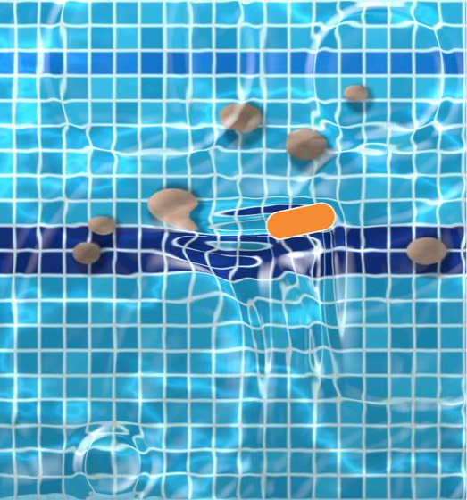
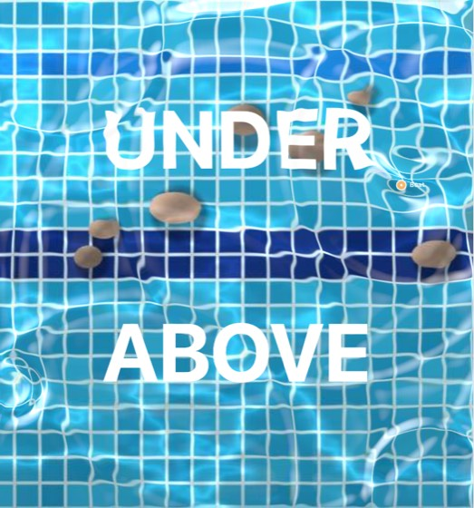
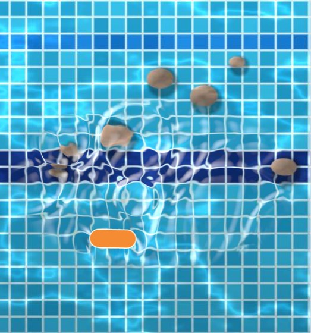

# The Water layer

*Play layers, 4 Oct 2026. The Look stack's water simulation as a layer: a place in the list, a region, readings, a matte.*

A **Water** layer is a simulated water surface that bends and lights what is **under** it: the picture and the layers below it in the list. Layers above it stay dry, so a boat drawn above the water sails on it and drags a wake without wobbling in that wake. It is the same simulation as the Look stack's **Water** effect (docs/finish-stack.md, Water): one solver, the same settings, presets, sources, shapes, rain and Splash.







Add it from **Add layer → Picture effects → Water**, or turn a Look stack's Water effect into one (its card's ⋯ → **Move to a layer**).

## Effect or layer

| | Water effect (Look stack) | Water layer |
|---|---|---|
| Bends | the finished picture: the picture and every layer | the picture and the layers below it |
| Where | the whole picture | the whole picture, or a box or ellipse (a pond) with a soft edge |
| Readings | none | Wave height at its Probe, Energy, Area |
| As a matte | other effects' Where → Where the water moves | any layer's Matte → this layer (its waves) |
| Splash | Rules → Do → Splash · Water (`finish:<id>`) | Rules → Do → Splash · *the layer* (its id) |

The effect stays, and saved stacks load as they were. The Add effect menu's Water item and the effect's card point to the layer. **Move to a layer** makes a Water layer over the whole picture at the top of the layers (so it still bends everything until layers are moved above it) with the effect's numbers, Source, Shape and Detail; the effect leaves the stack; controls on its numbers now drive the layer's (`finish:<id>::x` → `layer:<new>::sourceX`), and every rule's Splash, route or other reference to the effect names the layer. Effects in the stack with Where → Where the water moves have no water any more: the toast says how many.

## Settings

| | |
|---|---|
| **Region** | **Whole picture**, **Box** or **Ellipse**. A pond has its centre (X, Y), its size (Width, Height, in picture heights) and a **Soft edge** (picture heights over which its rim fades). It can reach past the picture: the water is simulated whole and only what is in view shows. |
| Shape, Source, Layer | What touches the water and where: a point, line, ring or two points at the Source (the pointer, a layer, Source X/Y, or none), a layer's shape, or the bright parts of what is under it (as the effect). The layer can be anywhere in the list: above the water (a boat), below, or hidden. |
| Size, Strength, Bob, Length, Angle | The source's (as the effect) |
| Wave speed, Damping, Open edges, Detail | How the waves move (as the effect). In a pond, Open edges lets waves leave through its box's sides; 0 bounces them off the box (an ellipse pond's rim is its box's sides, faded). |
| Rain, Drop size | Raindrops a second, in the region |
| Refraction, Highlights, Light angle | How the surface bends and lights what is under it |
| Opacity, Blend | How the bent picture lies over what is under it |
| Probe X / Y | Where Wave height is read |
| Feather | As a matte: how soft the edge of "where the water moves" is |
| **Presets** | Pond, Rain on glass, Boat wake, Ripple tank, Shockwave (the effect's) |
| **Splash now** | Drops a splash at the source (the middle without one) |

Every number is a layer number: the + makes it a control, mappings drive it. Lengths and speeds are in picture heights in a pond too: its waves are as big and as fast on the picture as the whole picture's.

## Readings

All 0..1, under **Accepts and emits** (meters, **Map…**, **Rule**), in the condition value picker's *Layer readings* (`read:<id>::<read>`) and the mapping source pickers (Sensor → the layer).

| Reading | Key | What |
|---|---|---|
| Wave height | `waveHeight` | The surface at Probe X/Y: 0.5 still (or outside the pond), 1 the top of a good wave (height 0.4, what fnWaves reads as 1), 0 as deep a trough |
| Energy | `energy` | √(6 × the mean of fnWaves²) over the region's shape: 0 still; a boat's wake about 0.2 to 0.5; rain and splashes everywhere 1 |
| Area | `area` | The share of the region's shape with waves on it (fnWaves above 0.25) |

Its centre is its anchor (distances and proximity). The example maps Wave height onto a boat's rotation: it rocks as waves pass under it.

## As a matte

Any layer's **Matte → the Water layer** shows that layer only where the water moves: white, alpha = fnWaves × 1.5 (solid on a good wave), blurred by **Feather** (two box passes), cut by the region's soft edge, scaled up into the region. Alpha and Luma read the same; Invert shows the still water. A Water layer used as a matte keeps running hidden, as it always does. A matte user drawn below the water sees the waves as the last frame left them.

## How it runs (one solver)

- **The kit** (`src/play/kit/kit.js`, `stepWater`) gives each Water layer its own Finish renderer (`fnCreate`, WebGL2) running a stack of one Water effect (`waterLayer.js wlEffect`). When the layer's turn comes in the draw order, what is under it (the picture, unless Layers only hides it, then the layers drawn so far), cut to its region, is the renderer's picture; the renderer steps the surface (`fnWaterFrame` and `FN_WATER_STEP`: the effect's code, untouched) and draws the bent, lit result, which the kit lays back at the region (through the soft edge, with Opacity and Blend). A hidden one is stepped after the others, drawing nothing.
- **Units.** The renderer's frame is the region. `wlValue` hands it the layer's numbers with Source X/Y and a Splash's point placed in the region and every length and speed divided by the region's height (in picture heights); `fnWaterGrid(detail, W, H, scale)` scales Detail's rows by it, so a pond's cell is the whole picture's size; the final pass's `uWUnit` (1 / scale; 1 for the Finish stack) turns slopes and curvature back into picture units, so refraction and highlights look the same. Positions the effect reads (the pointer, `layerPoint` of any layer, above it too) come in region coordinates.
- **Read back.** After each step the renderer packs the surface small (`FN_WATER_PACK`: 90 rows, height in 16 bits, fnWaves in 8) and `waterField` reads it (`fnWaterUnpack`); `wlReadings` and `wlMatteAlpha` work on that.
- **Deterministic.** The water ticks with the clock (60 ticks a second, `fnWaterTick`), rain falls where `fnWaterRain` says and a Splash once per firing time, so takes, offline renders (`SIMULATED_LAYER_KINDS`: warmed up from flat) and pages repeat it. An offline render's Splashes come from the take's own Look actions (`overlay.ts`, as the Finish stack's do).
- **Splash** is a Look action (`fnLookAct`) whose `layerId` is the Water layer's id: the hosts already read Look values for any id before mappings (`playEngine.layerValue`, the runtime's `layerValue`), so `splashT`, `splashX`… reach the layer's value() like a mapping.
- **Web pages** inline `waterLayer.js` after `finish.js` with the kit; the page's kit runs it the same way (a test runs the page's copy of the maths against the app's).
- Without WebGL2 (or a renderable half-float target) the layer draws nothing and reads still. A transparent export leaves its drawing out (it needs a picture to bend). Changing a pond's size in pixels starts its water flat.

## Saved form

```jsonc
{ "kind": "water", "region": "all" | "rect" | "ellipse", "x": 0.5, "y": 0.5, "w": 1, "h": 0.6, "soft": 0.04,
  "source": "pointer" | "layer" | "xy" | "none", "sourceLayer": "", "shape": "point" | "line" | "ring" | "twin" | "layer" | "picture", "shapeLayer": "",
  "detail": "low" | "medium" | "high",
  "speed": 0.35, "damping": 0.12, "size": 0.035, "strength": 1, "bob": 0, "refraction": 0.55, "highlights": 0.4, "light": 135,
  "sourceX": 0.5, "sourceY": 0.5, "length": 0.2, "angle": 0, "rain": 0, "drop": 0.012, "edges": 1,
  "probeX": 0.5, "probeY": 0.5, "feather": 0.02, "opacity": 1, "blend": "normal" }
```

The numbers are the Water effect's (`WL_PARAMS`, the same ranges, defaults and hints), with its `x`, `y` (Source X/Y) kept as `sourceX`, `sourceY`. A Splash reaction: `{ "do": "splash", "layerId": "<water layer id>", "key": "source" | "pointer" | "random" | "point", "value": 0.06, "x", "y" }`; one naming a missing layer is dropped on load. Removing a layer the water rides or is pushed by clears `sourceLayer` / `shapeLayer`.

## Where things live

| | |
|---|---|
| `src/play/kit/waterLayer.js` | region, units, the effect a layer runs, readings, the Waves matte |
| `src/play/kit/finish.js` | the solver and its look (shared): `fnWaterGrid`'s scale, `uWUnit`, `waterField`, `fnWaterUnpack` |
| `src/play/kit/kit.js` | `stepWater`, `waterEdge`, `waterMatte`: the renderer per layer, drawing, readings, matte |
| `src/types/playLayers.ts` | `WaterLayer`, defaults, schema, numbers |
| `src/play/waterLayers.ts` | `moveWaterToLayer`, `dropWaterRefs`, `waterLayerSources` |
| `src/components/play/layers/WaterEditor.tsx` | the card |
| `src/components/play/finish/FinishPanel.tsx` | Move to a layer; the Add effect menu's pointer to the layer |
| `src/play/__tests__/waterLayer.test.ts` | parsing, region masking, solver parity with the effect, a pond's units, determinism, the kit, Move to a layer, the page's copy, the example |

**Example**: Play → **Water layer: a boat and its wake**: a drawn boat above a Water layer sails a looping path on two LFOs and drags a wake without wobbling in it; a light rain falls; a click splashes under the pointer and Space somewhere random; the boat rocks by the Wave height under it.
